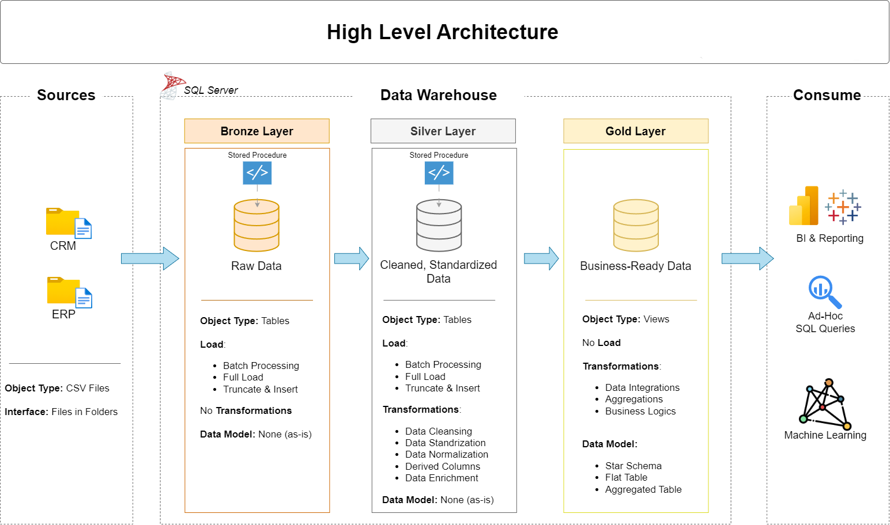

# Data Warehouse and Analytics Project

This repository presents a complete data warehousing and analytics solution, covering the full process from raw data ingestion to analytical reporting. The project is designed as a portfolio implementation demonstrating practical knowledge of data engineering and analytics best practices.

---

## Data Architecture

The project follows the Medallion Architecture with Bronze, Silver, and Gold layers.

1. Bronze Layer: Stores raw data as received from source systems. Data is ingested from CSV files into a SQL Server database.  
2. Silver Layer: Performs data cleansing, standardization, and transformation to prepare data for analysis.  
3. Gold Layer: Contains business-ready data modeled using a star schema optimized for reporting and analytics.

---

## Project Overview

This project includes:

1. Data Architecture: Design of a modern data warehouse using the Medallion Architecture (Bronze, Silver, Gold).  
2. ETL Pipelines: Extraction, transformation, and loading of data from source systems into the warehouse.  
3. Data Modeling: Development of fact and dimension tables optimized for analytical queries.  
4. Analytics and Reporting: SQL-based reports and analytical queries for business insights.

This project demonstrates hands-on experience in:

- SQL Development  
- Data Engineering  
- ETL Pipeline Development  
- Data Modeling  
- Data Analytics  

---

## Project Requirements

### Building the Data Warehouse

#### Objective

Develop a modern data warehouse using SQL Server to consolidate sales data and enable analytical reporting for business decision-making.

#### Specifications

- Data Sources: Import data from two source systems (ERP and CRM) provided as CSV files.  
- Data Quality: Perform data cleansing and resolve data quality issues before analysis.  
- Integration: Combine both sources into a single analytical data model.  
- Scope: Focus on the latest dataset only; historical data tracking is not implemented.  
- Documentation: Provide clear documentation of the data model to support business and analytics teams.

---

### Analytics and Reporting

#### Objective

Develop SQL-based analytics to generate insights into:

- Customer behavior  
- Product performance  
- Sales trends  

These insights support stakeholders with key business metrics for decision-making.

For detailed requirements, refer to docs/requirements.md.

---

## Repository Structure
```
data-warehouse-project/
│
├── datasets/                           Raw datasets used for the project (ERP and CRM data)
│
├── docs/                               Project documentation and architecture details
│   ├── etl.drawio                      ETL techniques and methods
│   ├── data_architecture.drawio        Project architecture design
│   ├── data_catalog.md                 Dataset catalog with field descriptions and metadata
│   ├── data_flow.drawio                Data flow diagrams
│   ├── data_models.drawio              Star schema data models
│   ├── naming-conventions.md           Naming guidelines for tables and columns
│
├── scripts/                            SQL scripts for ETL and transformations
│   ├── bronze/                         Scripts for raw data ingestion
│   ├── silver/                         Scripts for data cleaning and transformation
│   ├── gold/                           Scripts for analytical data models
│
├── tests/                              Test scripts and data quality checks
│
├── README.md                           Project overview and instructions
├── .gitignore                          Files excluded from version control
└── requirements.txt                    Project dependencies
```
---

## About This Project

This project was implemented as a guided data warehouse development exercise based on an industry-standard tutorial. The goal was to gain practical experience in designing data architecture, building ETL pipelines, creating analytical data models, and writing business-focused SQL queries.

---

## About the Author

This project is based on a guided learning implementation created by Data With Baraa. The implementation was followed to understand real-world data warehouse architecture, ETL design, and analytics development.
